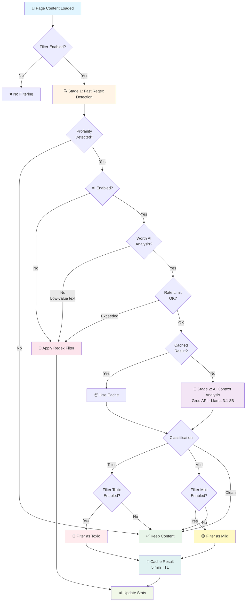
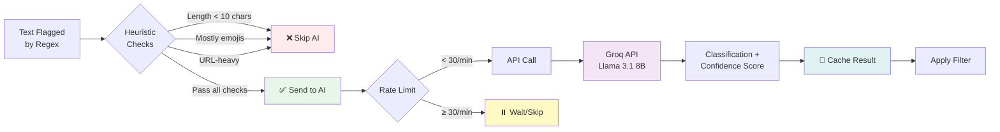
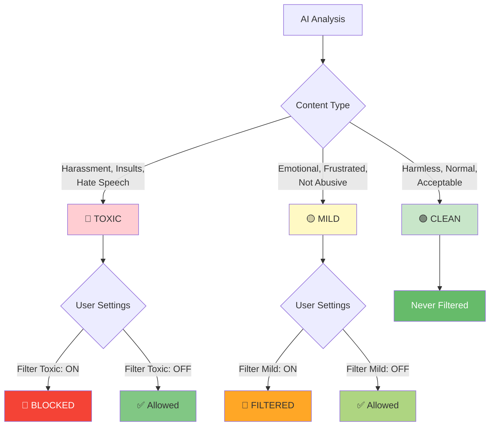

# 🚀 JoSan - AI-Powered Browser Extension

**JoSan** is an intelligent browser extension developed as part of an undergraduate thesis project by **Joren P. Verdad** and **Eisan Carlos B. Atamosa**. Built with modern web technologies like **React**, **TypeScript**, **Vite**, and **Tailwind CSS**, JoSan offers a streamlined and efficient development experience—designed with users' online safety and comfort in mind.

---

## 📖 Overview

JoSan enhances your browsing experience with advanced content moderation capabilities. This extension uses a **two-stage filtering system**: fast regex-based detection combined with optional **AI-powered context analysis** to intelligently filter profanity, harassment, and hate speech while minimizing false positives.


---

## ✨ Features

### Core Functionality

- ⚛️ Built with **React** for a responsive and modular UI
- 🛡️ **Two-stage filtering system**:
  - **Stage 1**: Fast regex-based profanity detection
  - **Stage 2**: AI context analysis for flagged content
- 🤖 **AI-Powered Classification** using Llama-3.1 8B
  - Distinguishes between toxic, mild, and clean content
  - Context-aware analysis reduces false positives
  - Configurable severity levels (filter toxic, mild, or both)
- ⚙️ Developed with **TypeScript** for strong type safety
- 💨 Lightning-fast builds using **Vite**
- 🎨 Styled with **Tailwind CSS**
- 🌐 Uses Chrome Extension APIs (Manifest V3)
- 🧩 Includes a **popup** interface and **options** page
- 🔧 Modular and maintainable project structure
- 🔒 **Privacy-first design** - filters only public feeds, never private messages

### AI Features

- 📊 **Real-time Usage Dashboard**
  - Track daily API usage (14,400 requests/day free tier)
  - Monitor per-minute rate limits (30 requests/minute)
  - View request history (last 30 days)
  - Estimated token usage and costs
- 🎯 **Smart Text Analysis**
  - Skips low-value content (emojis, URLs, short text)
  - Caches results for 5 minutes to reduce API calls
  - Automatic rate limit management
- 🔐 **Secure API Key Storage**
  - Keys stored locally in your browser only
  - API key validation before use

### Privacy & Control

- 🚫 **Multiple filter exclusions**:
  - Private messages (DMs) on all platforms
  - Chat interfaces
  - Input fields and forms
  - Password fields
- 🔧 **Per-platform control** - Enable/disable filtering for each social media site
- 📝 **Custom word lists** - Add your own words to filter
- 🎨 **Theme support** - Light and dark modes
- 📈 **Statistics tracking** - Monitor blocked words and pages scanned

---

## 🧠 Tech Stack

- **Frontend**: React 18
- **Language**: TypeScript
- **Build Tool**: Vite
- **Styling**: Tailwind CSS
- **Browser APIs**: Chrome Extension Manifest V3
- **AI Integration**: Llama-3.1 8B

---

## 🗂️ Project Structure

```
josan/
├── public/                    # Static assets
│   ├── icons/                 # Extension icons (PNG, SVG)
│   └── data/                  # Profanity word lists
├── src/                       # Source code
│   ├── background/            # Background service worker
│   ├── content/               # Content scripts
│   │   ├── config/            # Selector configurations
│   │   │   └── SelectorConfig.ts  # Feed and private content selectors
│   │   ├── utils/             # Utility modules
│   │   │   ├── PlatformDetector.ts    # Platform detection
│   │   │   ├── ProfanityLoader.ts     # Word list loader
│   │   │   ├── PrivacyFilter.ts       # Privacy content filtering
│   │   │   ├── StatisticsManager.ts   # Stats tracking
│   │   │   ├── GroqService.ts         # AI API integration
│   │   │   └── UsageTracker.ts        # API usage tracking
│   │   ├── filterProcessor.ts         # Main filtering logic
│   │   └── index.ts                   # Content script entry
│   ├── popup/                 # Popup UI components
│   │   └── Popup.tsx
│   ├── options/               # Options page components
│   │   ├── Options.tsx
│   │   └── components/
│   │       └── UsageDashboard.tsx     # AI usage dashboard
│   └── scripts/               # Build scripts
│       └── copy-assets.ts
├── dist/                      # Production-ready build output
├── release/                   # Packaged builds (.crx, .pem)
├── manifest.json              # Extension manifest (v3)
├── vite.config.ts             # Vite configuration
├── README.md                  # This file
└── SECURITY.md                # Security documentation
```

---

## 🧰 Prerequisites

Before you begin, ensure you have the following installed:

- **Node.js** (v16 or higher)
- **npm** or **Yarn**
- A Chromium-based browser (Chrome, Edge, Brave)
- **(Optional)** API key for AI features

---

## 🛠️ Installation

### 🔧 For Development

1. **Clone the repository**

```bash
git clone https://github.com/your-username/josan.git
cd josan
```

2. **Install dependencies**

```bash
npm install
# or
yarn
```

3. **Start development server**

```bash
npm run dev
# or
yarn dev
```

4. **Load the extension in your browser**

   ✅ Chrome

   - Visit `chrome://extensions/`
   - Enable **Developer mode**
   - Click **Load unpacked**
   - Select the `dist` folder

5. **The extension should now be installed and ready for testing**

---

### 📦 For Production

1. Download the latest `.zip` or `.crx` from the [Releases](https://github.com/shinjitsue/JoSan/tree/main/release) page
2. Install manually:

### Chrome:

- Go to `chrome://extensions/`
- Enable **Developer mode**
- Drag and drop the `.crx` file

---

## ⚙️ Configuration

### Basic Setup

1. Click the JoSan icon in your browser toolbar
2. Toggle the filter on/off using the switch
3. Click **Advanced Settings** to access the options page

### AI-Powered Filtering (Optional)

1. Go to **Advanced Settings** → **AI-Powered Context Analysis**
2. Enable **AI Double-Check**
3. Enter your API key
4. Click **Validate** to verify your key
5. Choose which content to filter:
   - **Toxic**: Harassment, insults, hate speech (recommended)
   - **Mild**: Emotional/frustrated but not abusive (optional)
6. Monitor your usage in the **Usage Dashboard**

**Free Tier Limits**:

- 14,400 requests per day
- 30 requests per minute
- First 100K requests are free

### Platform Selection

1. Go to **Advanced Settings** → **Active on Platforms**
2. Check/uncheck platforms where you want filtering active
3. Disabled platforms will not be processed at all

### Custom Words

1. Go to **Advanced Settings** → **Custom Words to Filter**
2. Type a word and click **Add**
3. Remove words by clicking **Remove** next to them

---

## 📜 Scripts

| Command           | Description                          |
| ----------------- | ------------------------------------ |
| `npm run dev`     | Start development mode               |
| `npm run build`   | Build the project for production     |
| `npm run preview` | Preview the production build locally |
| `npm run lint`    | Run ESLint for code quality checks   |

---

## 🏗️ Building the Extension

```bash
npm run build
# or
yarn build
```

The build output will be available inside the `dist/` folder.

---

## 🤖 AI Architecture

### Two-Stage Filtering System



### Key Optimizations

1. **Smart Text Selection**: Only sends suspicious text to AI
2. **Cache System**: 5-minute TTL, max 500 entries
3. **Rate Limiting**: Respects 30 req/min and 14,400 req/day limits
4. **Heuristic Skipping**: Ignores emojis, URLs, short text (<10 chars)
5. **Batch Processing**: Groups API calls efficiently

### AI Processing Details



### Classification System



### Performance Metrics

| Metric         | Stage 1 (Regex) | Stage 2 (AI) | Cached AI |
| -------------- | --------------- | ------------ | --------- |
| **Speed**      | ~0.1ms          | ~200-500ms   | ~0.1ms    |
| **Accuracy**   | 60-70%          | 90-95%       | 90-95%    |
| **Network**    | None            | Required     | None      |
| **Processing** | 100% local      | Cloud API    | Memory    |
| **Rate Limit** | None            | 30/min       | None      |

---

## 🤝 Contributing

We welcome contributions!

1. Fork the repo
2. Create a new branch:

   ```bash
   git checkout -b feature/amazing-feature
   ```

3. Commit your changes:

   ```bash
   git commit -m "Add amazing feature"
   ```

4. Push to GitHub:

   ```bash
   git push origin feature/amazing-feature
   ```

5. Open a Pull Request ✅

**Contribution Guidelines**:

- Follow TypeScript best practices
- Maintain privacy-first design principles
- Add tests for new features
- Update documentation

---

## 📄 License

This project is licensed under the **GNU General Public License v3.0**. See the [LICENSE](LICENSE) file for details.

---

## 👨‍🎓 Authors

- **Joren P. Verdad**
- **Eisan Carlos B. Atamosa**

---

## 🙏 Acknowledgments

- [React](https://reactjs.org/)
- [TypeScript](https://www.typescriptlang.org/)
- [Vite](https://vitejs.dev/)
- [Tailwind CSS](https://tailwindcss.com/)
- [Meta Llama](https://www.llama.com/) - Language Model

---

## 🛡️ Privacy & Security

**JoSan is designed with privacy as the top priority:**

### Data Processing

- 🔒 **Public Feeds Only**: Filters only public social media feeds and comments
- 💻 **100% Local Processing**: Base filtering happens on your device
- 🤖 **AI Privacy**: Only suspicious text is sent to Groq API (user's direct API key)
- 🚫 **Zero Data Collection**: No tracking, no analytics, no JoSan servers
- 🔐 **Minimal Permissions**: Only accesses specific social media domains

### Protected Content

JoSan **NEVER** accesses:

- ❌ Direct messages (DMs)
- ❌ Private conversations
- ❌ Chat/inbox areas
- ❌ Input fields you're typing in
- ❌ Password fields
- ❌ Forms and text editors
- ❌ Private channels (Discord)

### API Key Security

- 🔑 **Local Storage Only**: Your Groq API key is stored in your browser
- 🚫 **Never Shared**: Key is never sent to JoSan servers
- 🔐 **Direct Communication**: Your browser talks directly to Groq API
- ✅ **Validation**: API key validity is checked before use
- 🔒 **Encryption**: Stored securely using Chrome's storage API

See [SECURITY.md](./SECURITY.md) for detailed security information.

---

## 📊 Performance

### Filtering Speed

- **Regex Detection**: ~0.1ms per text node
- **AI Analysis**: ~200-500ms per request (cached results: instant)
- **Cache Hit Rate**: ~70-80% in typical usage

### Resource Usage

- **Memory**: ~50MB average (includes cache)
- **CPU**: <1% during normal browsing
- **Network**: Only when AI is enabled and content is flagged

---

## 🌐 Supported Platforms

JoSan actively filters profanity on **12 major social media platforms**:

### ✅ Currently Supported

| Platform  | Filtered Areas               | Private Areas Excluded       |
| --------- | ---------------------------- | ---------------------------- |
| Facebook  | News Feed, Posts, Comments   | Messenger, DMs               |
| Twitter/X | Timeline, Tweets, Replies    | Direct Messages              |
| Instagram | Feed, Stories, Comments      | Instagram Direct             |
| Reddit    | Posts, Comments, Subreddits  | Chat, Private Messages       |
| LinkedIn  | Feed, Posts, Comments        | LinkedIn Messaging           |
| TikTok    | For You Page, Comments       | TikTok Messages              |
| YouTube   | Comments, Community Posts    | Private Messages             |
| Tumblr    | Dashboard, Posts, Reblogs    | Tumblr Messaging             |
| Quora     | Answers, Comments, Spaces    | Quora Messages               |
| Threads   | Feed, Threads, Replies       | Threads DMs                  |
| Discord   | Public Servers/Channels Only | Direct Messages, Group Chats |
| BlueSky   | Feed, Posts, Replies         | Private Messages             |

### 🎯 Filter Scope

**What JoSan Filters:**

- ✅ Public posts and status updates
- ✅ Comments and replies
- ✅ Public timelines and feeds
- ✅ Community content
- ✅ Public channel messages (Discord only)

**What JoSan NEVER Filters:**

- ❌ Direct messages (DMs)
- ❌ Private conversations
- ❌ Chat/inbox areas
- ❌ Input fields you're typing in
- ❌ Password fields
- ❌ Forms and text editors
- ❌ Private channels (Discord)

### 🔧 Platform Selection

Users can enable/disable filtering for each platform individually through the **Options** page. Disabled platforms will not be filtered at all, giving you complete control over where JoSan is active.

---

## 📬 Contact

For inquiries or feedback, feel free to contact the authors or [open an issue](https://github.com/shinjitsue/JoSan/issues) on the repository.
