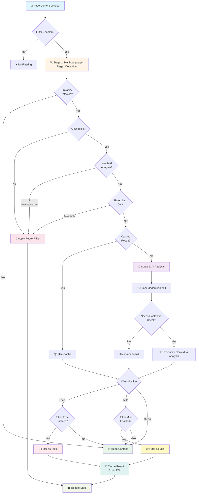
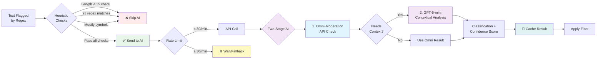
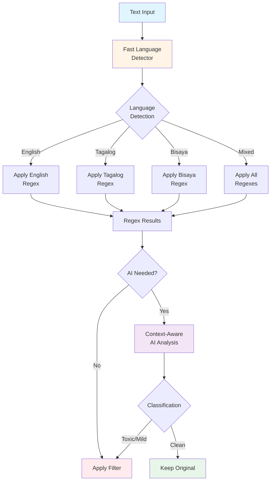
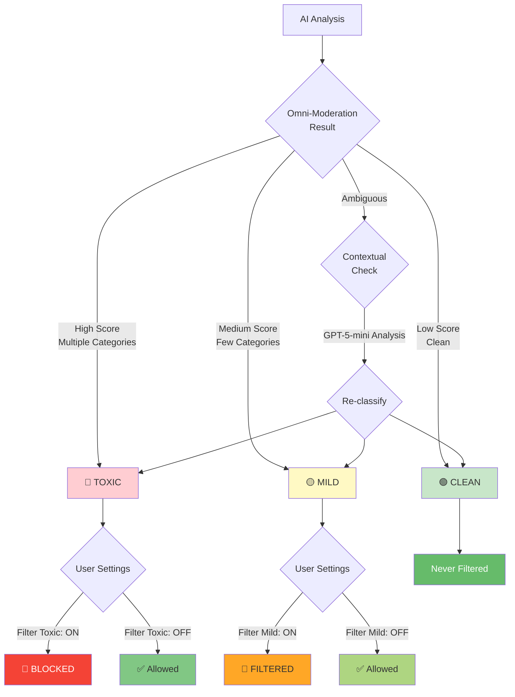

# 🚀 JoSan - AI-Powered Browser Extension

**JoSan** is an intelligent browser extension developed as part of an undergraduate thesis project by **Joren P. Verdad** and **Eisan Carlos B. Atamosa**. Built with modern web technologies like **React**, **TypeScript**, **Vite**, and **Tailwind CSS**, JoSan offers a streamlined and efficient development experience—designed with users' online safety and comfort in mind.

---

## 📖 Overview

JoSan enhances your browsing experience with advanced content moderation capabilities. This extension uses a **two-stage filtering system**: fast regex-based detection combined with optional **AI-powered context analysis** to intelligently filter profanity, harassment, and hate speech while minimizing false positives.


---

## ✨ Features

### Core Functionality

- ⚛️ Built with **React** for a responsive and modular UI
- 🛡️ **Two-stage filtering system**:
  - **Stage 1**: Fast regex-based profanity detection
  - **Stage 2**: AI context analysis for flagged content
- 🤖 **AI-Powered Classification** using OpenAI Moderation API
  - Uses **omni-moderation-latest** model and **GPT-5-mini** for content analysis
  - Distinguishes between toxic, mild, and clean content
  - Context-aware analysis reduces false positives
  - Configurable severity levels (filter toxic, mild, or both)
- 🌐 **Multi-language support**:
  - English, Tagalog, and Bisaya profanity detection
  - Smart language detection with confidence scoring
  - Mixed-language content handling
- ⚙️ Developed with **TypeScript** for strong type safety
- 💨 Lightning-fast builds using **Vite**
- 🎨 Styled with **Tailwind CSS**
- 🌐 Uses Chrome Extension APIs (Manifest V3)
- 🧩 Includes a **popup** interface and **options** page
- 🔧 Modular and maintainable project structure
- 🔒 **Privacy-first design** - filters only public feeds, never private messages

### AI Features

- 📊 **Real-time Usage Dashboard**
  - Track daily API usage (14,400 requests/day free tier)
  - Monitor per-minute rate limits (30 requests/minute)
  - View request history (last 30 days with charts)
  - Monthly usage tracking with automatic reset
  - Estimated token usage display
- 🎯 **Smart Text Analysis**
  - Multi-stage processing: regex → omni-moderation → contextual analysis (GPT-5-mini)
  - Skips low-value content (emojis, URLs, short text)
  - Caches results for 5 minutes to reduce API calls
  - Automatic rate limit management with cooldown
  - Batch processing for efficiency
- 🔐 **Secure API Key Storage**
  - Keys stored locally in your browser only
  - Configured in background service worker
  - API key validation before use
- 🆓 **Free Tier Support**
  - OpenAI Moderation API is free for most usage
  - No cost for content moderation
  - Clear rate limits and usage tracking

### Privacy & Control

- 🚫 **Multiple filter exclusions**:
  - Private messages (DMs) on all platforms
  - Chat interfaces
  - Input fields and forms
  - Password fields
- 🔧 **Per-platform control** - Enable/disable filtering for each social media site
- 📝 **Custom word lists** - Add your own words to filter
- 🎨 **Theme support** - Light, dark, and system modes
- 📈 **Statistics tracking** - Monitor blocked words and pages scanned

---

## 🧠 Tech Stack

- **Frontend**: React 19.1
- **Language**: TypeScript
- **Build Tool**: Vite + Webpack (for background scripts)
- **Styling**: Tailwind CSS
- **UI Components**: Radix UI (Alert Dialog, Switch, Slot)
- **Charts**: Recharts
- **Browser APIs**: Chrome Extension Manifest V3
- **AI Integration**: OpenAI Moderation API (omni-moderation-latest)

---

## 🗂️ Project Structure

```
josan/
├── public/                    # Static assets
│   ├── icons/                 # Extension icons (PNG, SVG)
│   └── data/                  # Profanity word lists
│       ├── en.txt            # English profanity list
│       ├── tl.txt            # Tagalog profanity list
│       └── bis.txt           # Bisaya profanity list
├── src/                       # Source code
│   ├── background/            # Background service worker
│   │   ├── index.ts          # Background script entry
│   │   └── BackgroundAIService.ts  # AI processing service
│   ├── content/               # Content scripts
│   │   ├── config/            # Selector configurations
│   │   │   └── SelectorConfig.ts  # Feed and private content selectors
│   │   ├── utils/             # Utility modules
│   │   │   ├── PlatformDetector.ts      # Platform detection
│   │   │   ├── ProfanityLoader.ts       # Word list loader
│   │   │   ├── PrivacyFilter.ts         # Privacy content filtering
│   │   │   ├── StatisticsManager.ts     # Stats tracking
│   │   │   ├── UsageTracker.ts          # API usage tracking
│   │   │   └── FastLanguageDetector.ts  # Multi-language detection
│   │   ├── filtering/         # Core filtering logic
│   │   │   ├── SettingsManager.ts       # Settings management
│   │   │   ├── FilterEngine.ts          # Text analysis engine
│   │   │   ├── ContentAIProxy.ts        # AI communication proxy
│   │   │   └── DOMProcessor.ts          # DOM manipulation
│   │   ├── FilterProcessor.ts           # Main filter coordinator
│   │   └── index.ts                     # Content script entry
│   ├── popup/                 # Popup UI components
│   │   ├── Popup.tsx
│   │   ├── hooks/            # React hooks
│   │   │   ├── useSettings.ts
│   │   │   ├── usePlatform.ts
│   │   │   └── useTheme.ts
│   │   └── components/       # Popup components
│   │       ├── Header.tsx
│   │       ├── FilterToggle.tsx
│   │       ├── StatsGrid.tsx
│   │       ├── PlatformStatus.tsx
│   │       ├── AIToggle.tsx
│   │       ├── AIUsageStats.tsx
│   │       └── SettingsButton.tsx
│   ├── options/               # Options page components
│   │   ├── Options.tsx
│   │   └── components/
│   │       ├── BasicSettings.tsx
│   │       ├── AISettings.tsx
│   │       ├── ThemeSettings.tsx
│   │       ├── PlatformSettings.tsx
│   │       ├── CustomWords.tsx
│   │       ├── PrivacySettings.tsx
│   │       ├── UsageDashboard.tsx
│   │       └── dashboard/    # Dashboard sub-components
│   │           ├── DashboardCard.tsx
│   │           ├── DailyUsageCard.tsx
│   │           ├── RateLimitCard.tsx
│   │           ├── TotalStatsGrid.tsx
│   │           ├── CostEstimateCard.tsx
│   │           ├── RequestHistoryCard.tsx
│   │           ├── QuickLinksCard.tsx
│   │           └── useDashboardLogic.ts
│   ├── components/ui/         # Reusable UI components
│   │   ├── card.tsx
│   │   ├── button.tsx
│   │   ├── input.tsx
│   │   ├── switch.tsx
│   │   ├── badge.tsx
│   │   ├── alert.tsx
│   │   ├── alert-dialog.tsx
│   │   ├── chart.tsx
│   │   └── kbd.tsx
│   └── scripts/               # Build scripts
│       └── copy-assets.ts
├── dist/                      # Production-ready build output
├── release/                   # Packaged builds (.crx, .pem)
│   └── v1/
│       └── josan-v1.0.0.crx
├── manifest.json              # Extension manifest (v3)
├── popup.html                 # Popup HTML entry
├── options.html               # Options HTML entry
├── vite.config.ts             # Vite configuration
├── webpack.config.js          # Webpack configuration (background script)
├── tsconfig.json              # TypeScript configuration
├── tsconfig.app.json          # App-specific TypeScript config
├── tsconfig.node.json         # Node-specific TypeScript config
├── tailwind.config.js         # Tailwind CSS configuration
├── postcss.config.js          # PostCSS configuration
├── package.json               # Dependencies and scripts
├── README.md                  # This file
└── SECURITY.md                # Security documentation
```

---

## 🧰 Prerequisites

Before you begin, ensure you have the following installed:

- **Node.js** (v16 or higher)
- **npm** or **Yarn**
- A Chromium-based browser (Chrome, Edge, Brave)
- **(Optional)** OpenAI API key for AI features

---

## 🛠️ Installation

### 🔧 For Development

1. **Clone the repository**

```bash
git clone https://github.com/shinjitsue/JoSan.git
cd josan
```

2. **Install dependencies**

```bash
npm install
# or
yarn
```

3. **Start development server**

```bash
npm run dev
# or
yarn dev
```

4. **Load the extension in your browser**

   ✅ Chrome

   - Visit `chrome://extensions/`
   - Enable **Developer mode**
   - Click **Load unpacked**
   - Select the `dist` folder

5. **The extension should now be installed and ready for testing**

---

### 📦 For Production

1. Download the latest `.crx` from the [Releases](https://github.com/shinjitsue/JoSan/tree/main/release) page
2. Install manually:

### Chrome:

- Go to `chrome://extensions/`
- Enable **Developer mode**
- Drag and drop the `.crx` file

---

## ⚙️ Configuration

### Basic Setup

1. Click the JoSan icon in your browser toolbar
2. Toggle the filter on/off using the switch
3. Click **Advanced Settings** to access the options page

### AI-Powered Filtering (Optional)

1. Go to **Advanced Settings** → **AI-Powered Context Analysis**
2. Enable **AI Double-Check**
3. Enter your OpenAI API key
4. Click **Validate** to verify your key
5. Choose which content to filter:
   - **Toxic**: Harassment, insults, hate speech (recommended)
   - **Mild**: Emotional/frustrated but not abusive (optional)
6. Monitor your usage in the **Usage Dashboard**

**Free Tier Limits**:

- 14,400 requests per day
- 30 requests per minute
- OpenAI Moderation API is free for most usage tiers

### Platform Selection

1. Go to **Advanced Settings** → **Active on Platforms**
2. Check/uncheck platforms where you want filtering active
3. Disabled platforms will not be processed at all

### Custom Words

1. Go to **Advanced Settings** → **Custom Words to Filter**
2. Type a word and click **Add**
3. Remove words by clicking **Remove** next to them
4. Use **Clear All** to remove all custom words at once

---

## 📜 Scripts

| Command                 | Description                           |
| ----------------------- | ------------------------------------- |
| `npm run dev`           | Start development mode with Vite      |
| `npm run build`         | Build for production (all stages)     |
| `npm run build:vite`    | Build Vite components (popup/options) |
| `npm run build:webpack` | Build background script with Webpack  |
| `npm run copy-assets`   | Copy static assets to dist/           |
| `npm run preview`       | Preview the production build locally  |
| `npm run lint`          | Run ESLint for code quality checks    |

---

## 🏗️ Building the Extension

```bash
npm run build
# or
yarn build
```

This will:

1. Build React components with Vite
2. Build background script with Webpack
3. Copy assets (manifest, icons, word lists) to `dist/`

The build output will be available inside the `dist/` folder.

---

## 🤖 AI Architecture

### Two-Stage Filtering System



### Key Optimizations

1. **Smart Text Selection**: Only sends suspicious text to AI
2. **Cache System**: 5-minute TTL, max 1000 entries
3. **Rate Limiting**: Respects 30 req/min and 14,400 req/day limits
4. **Heuristic Skipping**: Ignores emojis, URLs, short text (<10 chars)
5. **Batch Processing**: Groups up to 5 API calls efficiently
6. **Multi-language Detection**: Analyzes English, Tagalog, and Bisaya
7. **Language-aware Filtering**: Applies appropriate regex per language
8. **Cooldown Mechanism**: Temporarily pauses after repeated failures

### AI Processing Details



### Multi-Language Support



### Classification System



### Performance Metrics

| Metric               | Stage 1 (Regex)                                       | Stage 2 (Omni / Small LLM)                                     | Stage 3 (GPT-5-mini, Cloud)                              | Cached AI                                 |
| -------------------- | ----------------------------------------------------- | -------------------------------------------------------------- | -------------------------------------------------------- | ----------------------------------------- |
| **Speed (per post)** | **~0.1–10 ms**                                        | **~50–300 ms**                                                 | **~200–800 ms**                                          | **~0.1–5 ms**                             |
| **Accuracy**         | Precision **95–99%**, Recall **20–60%** (F1: ~32–74%) | Precision **90–95%**, Recall **70–85%** (F1: ~79–89%)          | Precision **92–98%**, Recall **85–95%** (F1: ~88–96%)    | Same as model that produced cached output |
| **Network**          | None                                                  | Required                                                       | Required                                                 | None (unless cache miss)                  |
| **Processing**       | Local                                                 | Cloud or local LLM server                                      | Cloud (OpenAI API)                                       | Local memory                              |
| **Rate Limit**       | None                                                  | Depends on provider                                            | Depends on provider                                      | None                                      |

---

## 🤝 Contributing

We welcome contributions!

1. Fork the repo
2. Create a new branch:

   ```bash
   git checkout -b feature/amazing-feature
   ```

3. Commit your changes:

   ```bash
   git commit -m "Add amazing feature"
   ```

4. Push to GitHub:

   ```bash
   git push origin feature/amazing-feature
   ```

5. Open a Pull Request ✅

**Contribution Guidelines**:

- Follow TypeScript best practices
- Maintain privacy-first design principles
- Add tests for new features
- Update documentation
- Ensure all builds pass (`npm run build`)

---

## 📄 License

This project is licensed under the **GNU General Public License v3.0**. See the [LICENSE](LICENSE) file for details.

---

## 👨‍🎓 Authors

- **Joren P. Verdad**
- **Eisan Carlos B. Atamosa**

---

## 🙏 Acknowledgments

- [React](https://reactjs.org/)
- [TypeScript](https://www.typescriptlang.org/)
- [Vite](https://vitejs.dev/)
- [Tailwind CSS](https://tailwindcss.com/)
- [Radix UI](https://www.radix-ui.com/)
- [Recharts](https://recharts.org/)
- [OpenAI](https://openai.com/) - Moderation API

---

## 🛡️ Privacy & Security

**JoSan is designed with privacy as the top priority:**

### Data Processing

- 🔒 **Public Feeds Only**: Filters only public social media feeds and comments
- 💻 **Local-First Processing**: Base filtering (regex) happens on your device
- 🤖 **Selective AI Analysis**: Only suspicious text (after regex detection) is sent to OpenAI
- 🚫 **Zero Data Collection**: No tracking, no analytics, no JoSan servers
- 🔐 **Minimal Permissions**: Only accesses specific social media domains

### Protected Content

JoSan **NEVER** accesses:

- ❌ Direct messages (DMs)
- ❌ Private conversations
- ❌ Chat/inbox areas
- ❌ Input fields you're typing in
- ❌ Password fields
- ❌ Forms and text editors
- ❌ Private channels (Discord)

### API Key Security

- 🔑 **Local Storage Only**: Your OpenAI API key is stored in your browser
- 🚫 **Never Shared**: Key is never sent to JoSan servers (we don't have any!)
- 🔐 **Direct Communication**: Your browser talks directly to OpenAI API
- ✅ **Validation**: API key validity is checked before use
- 🔒 **Secure Transfer**: API key is securely passed to background service worker
- 🛡️ **Background Processing**: AI requests are processed in isolated service worker

### OpenAI Data Handling

When AI is enabled:

- Only text flagged by regex is sent to OpenAI
- Requests use OpenAI's Moderation API (free tier)
- OpenAI's data usage policy applies
- No personal information is included in requests
- Results are cached locally to minimize API calls

See [SECURITY.md](./SECURITY.md) for detailed security information.

---

## 📊 Performance

### Filtering Speed

- **Language Detection**: ~0.1ms per text node
- **Regex Detection**: ~0.2ms per text node (all 3 languages)
- **Omni-Moderation API**: ~200-400ms per request
- **Contextual Analysis**: ~400-600ms per request (when needed)
- **Cache Hit Rate**: ~70-80% in typical usage

### Resource Usage

- **Memory**: ~60-80MB average (includes cache and components)
- **CPU**: <1% during normal browsing, ~2-3% during page load
- **Network**: Only when AI is enabled and content is flagged

### Optimization Features

- **Batch Processing**: Groups up to 5 AI requests
- **Smart Caching**: 5-minute TTL, 1000 entry limit
- **Approved Nodes Tracking**: Prevents re-checking clean content
- **Text Hash Deduplication**: Skips identical text
- **Lazy Loading**: Dashboard components load on demand

---

## 🌐 Supported Platforms

JoSan actively filters profanity on **12 major social media platforms**:

### ✅ Currently Supported

| Platform  | Filtered Areas               | Private Areas Excluded       |
| --------- | ---------------------------- | ---------------------------- |
| Fabisook  | News Feed, Posts, Comments   | Messenger, DMs               |
| Twitter/X | Timeline, Tweets, Replies    | Direct Messages              |
| Instagram | Feed, Stories, Comments      | Instagram Direct             |
| Reddit    | Posts, Comments, Subreddits  | Chat, Private Messages       |
| LinkedIn  | Feed, Posts, Comments        | LinkedIn Messaging           |
| TikTok    | For You Page, Comments       | TikTok Messages              |
| YouTube   | Comments, Community Posts    | Private Messages             |
| Tumblr    | Dashboard, Posts, Reblogs    | Tumblr Messaging             |
| Quora     | Answers, Comments, Spaces    | Quora Messages               |
| Threads   | Feed, Threads, Replies       | Threads DMs                  |
| Discord   | Public Servers/Channels Only | Direct Messages, Group Chats |
| BlueSky   | Feed, Posts, Replies         | Private Messages             |

### 🎯 Filter Scope

**What JoSan Filters:**

- ✅ Public posts and status updates
- ✅ Comments and replies
- ✅ Public timelines and feeds
- ✅ Community content
- ✅ Public channel messages (Discord only)

**What JoSan NEVER Filters:**

- ❌ Direct messages (DMs)
- ❌ Private conversations
- ❌ Chat/inbox areas
- ❌ Input fields you're typing in
- ❌ Password fields
- ❌ Forms and text editors
- ❌ Private channels (Discord)

### 🔧 Platform Selection

Users can enable/disable filtering for each platform individually through the **Options** page. Disabled platforms will not be filtered at all, giving you complete control over where JoSan is active.

---

## 🌍 Language Support

JoSan supports **3 languages** for profanity detection:

### Supported Languages

1. **English (EN)**

   - Comprehensive profanity word list
   - Native language support
   - ~1,000+ words

2. **Tagalog/Filipino (TL)**

   - Filipino profanity detection
   - Cultural context awareness
   - ~500+ words

3. **Bisaya (BIS)**
   - Bisaya profanity detection
   - Regional expressions
   - ~50+ words

### Language Detection Features

- **Automatic Detection**: Identifies language automatically
- **Confidence Scoring**: Measures detection accuracy (0-100%)
- **Mixed Language Support**: Handles code-switching
- **Character Frequency Analysis**: Enhanced accuracy
- **Context-Aware AI**: Considers cultural nuances in each language

---

## 📬 Contact

For inquiries or feedback, feel free to contact the authors or [open an issue](https://github.com/shinjitsue/JoSan/issues) on the repository.

---

## 🐛 Troubleshooting

### Common Issues

**AI not working:**

- Ensure you have a valid OpenAI API key
- Check that AI is enabled in Advanced Settings
- Verify rate limits haven't been exceeded
- Check browser console for errors

**Filter not working on a platform:**

- Verify the platform is enabled in Platform Settings
- Ensure the global filter is enabled
- Try reloading the page
- Check if you're on a private page (DMs, inbox)

**Extension not loading:**

- Ensure you're using a Chromium-based browser
- Check that the extension is enabled in `chrome://extensions/`
- Try disabling and re-enabling the extension
- Check browser console for initialization errors

### Debug Mode

For developers:

```javascript
// In browser console
window.JoSanDebug.getFilter(); // Get filter instance
window.JoSanDebug.reprocess(); // Re-run filtering
window.JoSanDebug.getStats(); // View statistics
```

---

## 🔄 Version History

### v2.1.0 (Current)

- ✨ Multi-language support (English, Tagalog, Bisaya)
- 🤖 Switched to OpenAI Moderation API
- 📊 Enhanced usage dashboard with charts
- 🎯 Improved AI accuracy with two-stage analysis
- 🚀 Performance optimizations
- 🛡️ Better privacy controls

### v1.0.0

- 🎉 Initial release
- 🤖 Basic AI filtering with Groq API
- 📱 12 platform support
- 🎨 Modern UI with Tailwind CSS

