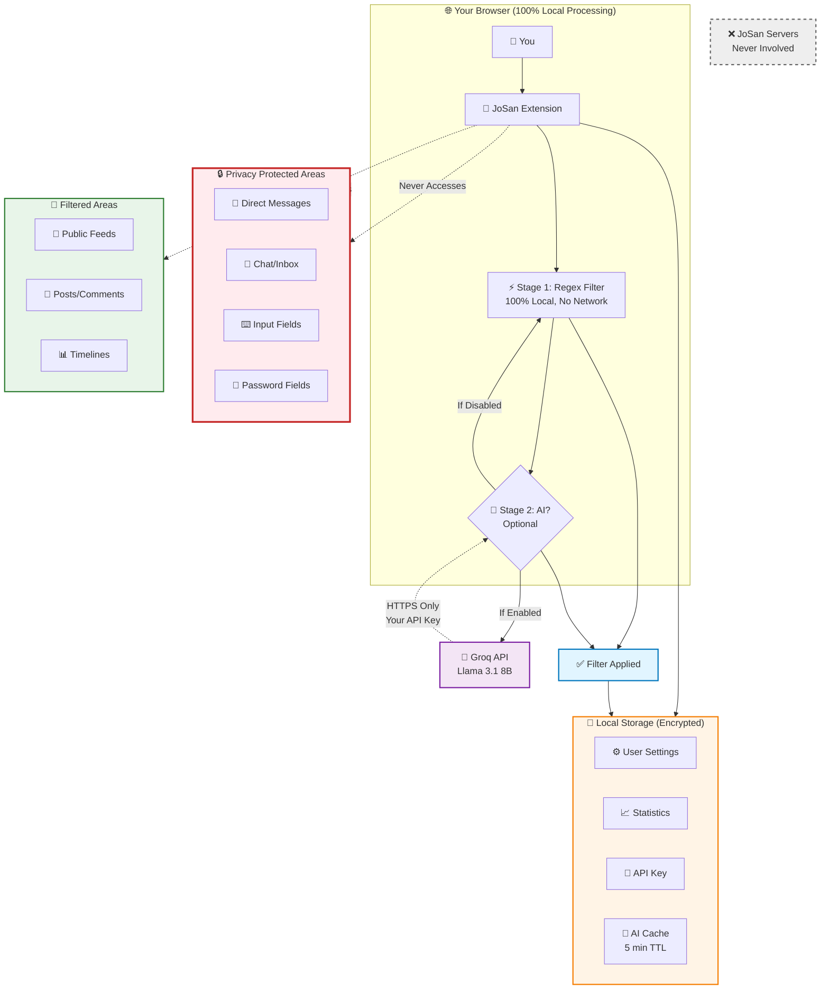
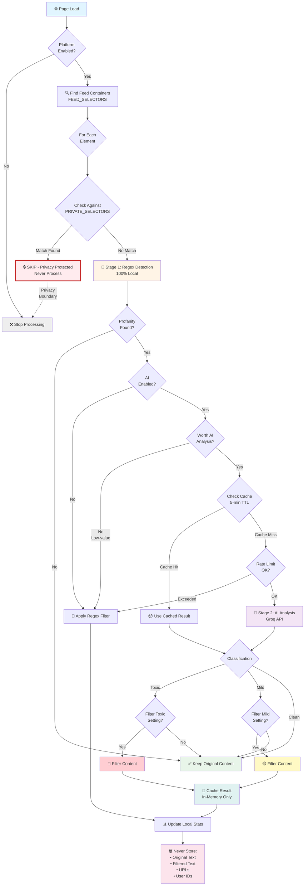
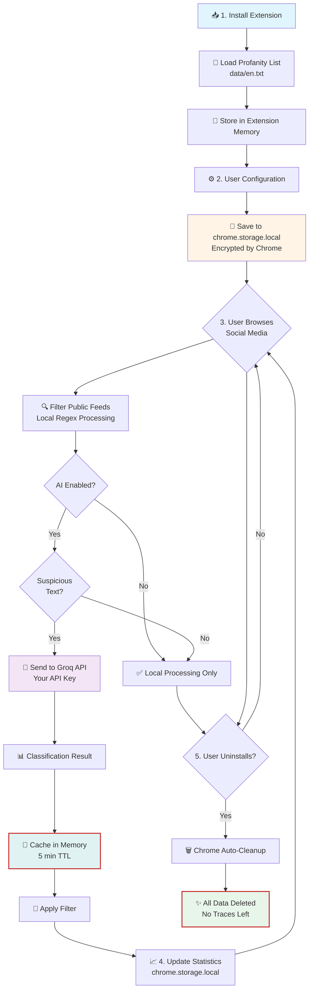
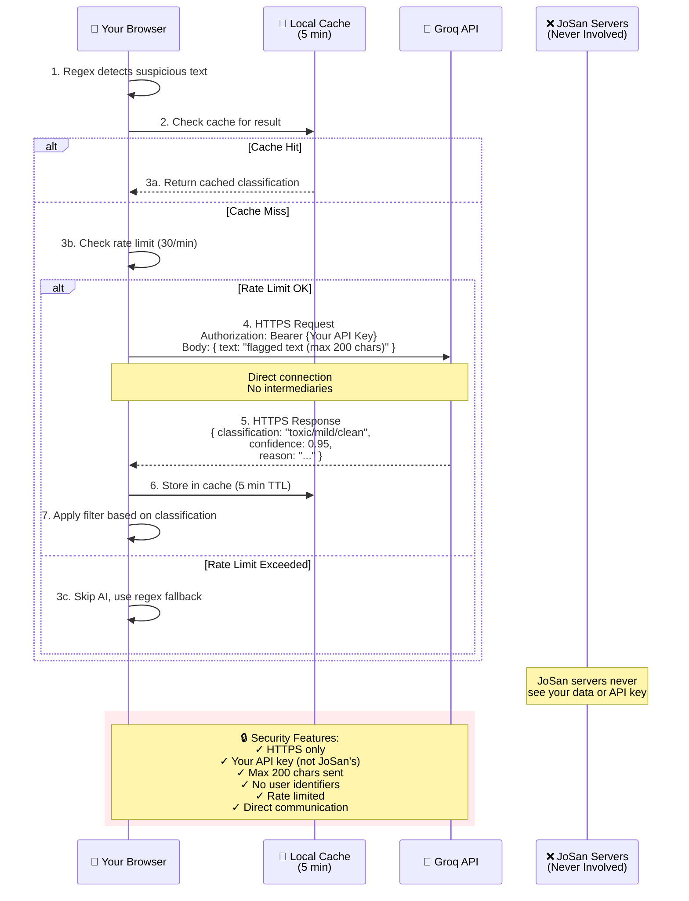

# 🔒 Security & Privacy Policy

## Mission Statement

**JoSan is committed to protecting your privacy while providing effective profanity filtering.** We believe that content moderation should never come at the cost of user privacy. This document explains how we achieve this balance through our two-stage filtering system and privacy-first architecture.

---

## 🏗️ System Architecture Overview



**Privacy Guarantees:**

- 🔒 **Red zones** = Never accessed by JoSan
- 🟢 **Green zones** = Only public content filtered
- 🟡 **Yellow zones** = Data stays in your browser (encrypted)
- 🟣 **Purple connection** = Only when AI enabled, uses your key
- ⭕ **Grayed out** = JoSan has no servers in this flow

---

## 🎯 What JoSan Does

JoSan filters profanity **only in public social media feeds** using a two-stage system:

### Stage 1: Local Regex Filtering

- Fast pattern matching against a profanity word list
- Runs 100% locally on your device
- No network requests
- Processes all visible content

### Stage 2: AI Context Analysis (Optional)

- Only checks content flagged by Stage 1
- Uses Groq API (your personal API key)
- Context-aware classification: toxic, mild, or clean
- Configurable filtering levels
- Smart caching to minimize API calls

### Supported Platforms

✅ **Facebook** - News Feed, Posts, Comments  
✅ **Twitter/X** - Timeline, Tweets, Replies  
✅ **Instagram** - Feed, Stories, Comments  
✅ **Reddit** - Posts, Comments, Subreddits  
✅ **LinkedIn** - Feed, Posts, Comments  
✅ **TikTok** - For You Page, Comments  
✅ **YouTube** - Comments, Community Posts  
✅ **Tumblr** - Dashboard, Posts, Reblogs  
✅ **Quora** - Answers, Comments, Spaces  
✅ **Threads** - Feed, Threads, Replies  
✅ **Discord** - Public Servers/Channels Only  
✅ **BlueSky** - Feed, Posts, Replies

### Processing Details

**Local Processing (Stage 1)**:

- All regex filtering happens on your device
- No data is transmitted for base profanity detection
- Filter word list is stored locally in the extension

**AI Processing (Stage 2, Optional)**:

- Only suspicious text (flagged by regex) is sent to Groq API
- Uses your personal API key (stored locally)
- Direct communication between your browser and Groq
- No JoSan servers involved
- 5-minute cache reduces redundant API calls

---

## 🚫 What JoSan DOES NOT Do

### Private Content Protection

JoSan **explicitly excludes** these areas from filtering:

#### ❌ Direct Messages & Private Conversations

- Facebook Messenger
- Instagram Direct
- Twitter/X DMs
- Reddit Chat
- LinkedIn Messaging
- TikTok Messages
- Tumblr Messages
- Quora Messages
- Threads DMs
- Discord Direct Messages & Group Chats
- BlueSky Private Messages

#### ❌ Input Fields & Forms

- Text areas you're typing in
- Password fields
- Login forms
- Comment composers (while typing)
- Search boxes
- All `contenteditable` fields

#### ❌ Personal Data

- Profile information
- Settings pages
- Account details
- Email addresses
- Phone numbers
- Inbox/notification areas

---

## 🛠️ Technical Implementation

### 1. Selective Processing Architecture

```typescript
// JoSan uses two selector arrays:

// FEED_SELECTORS: What we filter (40+ selectors)
FEED_SELECTORS = [
  'div[role="feed"]', // Facebook feed
  'article[data-testid="tweet"]', // Twitter posts
  "ytd-comment-thread-renderer", // YouTube comments
  'div[data-testid="feedItem"]', // BlueSky
  // ... 40+ platform-specific feed selectors
];

// PRIVATE_SELECTORS: What we skip (20+ patterns)
PRIVATE_SELECTORS = [
  '[data-testid*="message"]', // Message areas
  '[class*="chat"]', // Chat interfaces
  '[class*="dm"]', // Direct messages
  '[aria-label*="conversation"]', // Conversation threads
  'input[type="password"]', // Password fields
  "textarea", // Input fields
  '[contenteditable="true"]', // Rich text editors
  // ... 20+ private content patterns
];
```

### 2. Privacy-First Logic Flow



### 3. Platform Detection

JoSan detects the current platform by hostname:

```typescript
detectPlatform(): string {
  if (hostname.includes("facebook.com")) return "facebook";
  if (hostname.includes("twitter.com") || hostname.includes("x.com")) return "twitter";
  // ... 12 platforms total
  return "unknown"; // If not supported, don't filter
}
```

**If platform is not in the supported list, JoSan does nothing.**

### 4. Smart Text Analysis

```typescript
// Heuristics to skip unnecessary AI checks
shouldSkipAICheck(text: string): boolean {
  // Skip if too short (< 10 chars)
  if (text.length < 10) return true;

  // Skip if mostly emojis/special chars
  const alphanumericRatio = (text.match(/[a-zA-Z0-9]/g) || []).length / text.length;
  if (alphanumericRatio < 0.3) return true;

  // Skip if URL-heavy
  const urlMatches = text.match(/(https?:\/\/[^\s]+)/g) || [];
  if (urlMatches.length > 2) return true;

  return false;
}
```

---

## 🔐 Data Handling & Storage

### What Gets Stored Locally

| Data Type        | Storage Location       | Purpose                        | Synced? | Encrypted? |
| ---------------- | ---------------------- | ------------------------------ | ------- | ---------- |
| Filter word list | `dist/data/en.txt`     | Profanity detection            | No      | No         |
| Custom words     | `chrome.storage.local` | User-added filter words        | No      | Yes\*      |
| Enabled state    | `chrome.storage.local` | Filter on/off preference       | No      | Yes\*      |
| Platform toggles | `chrome.storage.local` | Per-platform enable/disable    | No      | Yes\*      |
| Statistics       | `chrome.storage.local` | Word count, page scans         | No      | Yes\*      |
| Groq API key     | `chrome.storage.local` | AI service authentication      | No      | Yes\*      |
| AI settings      | `chrome.storage.local` | Filter levels (toxic/mild)     | No      | Yes\*      |
| Usage stats      | `chrome.storage.local` | API request tracking           | No      | Yes\*      |
| AI cache         | In-memory only         | Temporary classification cache | No      | N/A        |

\*Encrypted by Chrome's storage API

### What Is NEVER Stored

- ❌ Filtered text content
- ❌ Original text content (except temporarily during processing)
- ❌ URLs of visited pages
- ❌ User's browsing history
- ❌ Personal information
- ❌ Message content
- ❌ AI API responses (except in 5-minute memory cache)
- ❌ Any data sent to external servers (besides Groq API)

### Cache Management

```typescript
// AI response cache (in-memory only)
Cache TTL: 5 minutes
Max size: 500 entries
Cleanup: Automatic when expired or full
Persistence: None (cleared on extension restart)
```

---

## 🔍 Permissions Explained

JoSan requests minimal permissions:

### `storage` Permission

- **Why**: To save your filter preferences and API key locally
- **Scope**: Chrome's local storage API only (not synced across devices)
- **Data**: Filter state, custom words, statistics, API key, AI settings
- **Security**: Encrypted by Chrome, never leaves your device

### `host_permissions` (14 domains)

- **Why**: To run content scripts on supported platforms
- **Scope**: Only the 13 social media platforms + Groq API
- **Limitation**: Cannot access other websites

```json
"host_permissions": [
  "*://*.facebook.com/*",
  "*://*.twitter.com/*",
  "*://*.x.com/*",
  "*://*.instagram.com/*",
  "*://*.reddit.com/*",
  "*://*.linkedin.com/*",
  "*://*.tiktok.com/*",
  "*://*.youtube.com/*",
  "*://*.tumblr.com/*",
  "*://*.quora.com/*",
  "*://*.threads.net/*",
  "*://*.discord.com/*",
  "*://*.bsky.app/*"
]
```

### Permissions We DON'T Request

- ❌ `cookies` - We don't access your cookies
- ❌ `history` - We don't read your browsing history
- ❌ `tabs` - We don't monitor your open tabs
- ❌ `webRequest` - We don't intercept network requests
- ❌ `<all_urls>` - We only work on supported platforms
- ❌ `identity` - We don't access your Google account
- ❌ `downloads` - We don't access your downloads
- ❌ `notifications` - We don't send notifications

---

## 🛡️ Security Features

### 1. Content Security Policy

- No external scripts allowed
- All code runs locally
- No inline JavaScript evaluation
- No remote code loading
- Strict CSP headers in manifest

### 2. Manifest V3 Compliance

JoSan uses Chrome's **Manifest V3**, the most secure extension format:

- Service worker instead of background pages
- Declarative permissions
- Enhanced security sandbox
- No `eval()` or dynamic code execution
- Isolated worlds for content scripts

### 3. Open Source Transparency

- **All code is public** on GitHub
- Community can audit for security issues
- No obfuscated or hidden code
- Licensed under GNU GPL v3.0
- Regular security audits

### 4. API Key Security

```typescript
// API key handling
✅ Stored locally in chrome.storage (encrypted by Chrome)
✅ Never logged to console
✅ Never sent to JoSan servers
✅ Validated before use
✅ User controls visibility (show/hide toggle)
✅ Direct HTTPS communication with Groq only

❌ Never stored in plain text files
❌ Never included in error messages
❌ Never transmitted to third parties
```

### 5. Rate Limiting & Abuse Prevention

```typescript
// Automatic rate limit management
Per-minute: 30 requests (enforced before API call)
Per-day: 14,400 requests (tracked locally)
Cache: 5-minute TTL to reduce redundant calls
Smart skipping: Low-value content not sent to API
```

---

## 🚨 Privacy Violations We Prevent

### 1. Message/DM Access

**Problem**: Many filter extensions read private messages.

**JoSan Solution**:

```typescript
PRIVATE_SELECTORS = [
  '[data-testid*="message"]',
  '[class*="chat"]',
  '[class*="dm"]',
  '[aria-label*="Direct Messages"]',
  'section[class*="x1qjc9v5"][role="main"]', // Instagram DM
  '[data-testid="DMDrawer"]', // Twitter DM
  'shreddit-async-loader[bundlename="chat"]', // Reddit chat
  // ... comprehensive blacklist
];

if (isPrivateContent(element)) {
  console.log("[JoSan] Skipping private content area");
  return; // Don't filter, don't send to AI
}
```

### 2. Input Field Monitoring

**Problem**: Reading what users type in real-time.

**JoSan Solution**:

```typescript
PRIVATE_SELECTORS = [
  'input[type="password"]',
  "textarea",
  'input[type="text"]',
  '[contenteditable="true"]',
  '[role="textbox"]',
];

// Input fields are NEVER processed
```

### 3. Data Exfiltration

**Problem**: Sending filtered content to servers.

**JoSan Solution**:

- ✅ Zero network requests for base filtering (regex)
- ✅ AI requests only for flagged content (user's API key)
- ✅ No analytics or tracking code
- ✅ No JoSan servers in the communication chain
- ✅ All processing is local or user-controlled

### 4. API Key Exposure

**Problem**: Extensions storing API keys insecurely.

**JoSan Solution**:

- ✅ Keys stored in Chrome's encrypted storage
- ✅ Never logged or exposed in console
- ✅ Show/hide toggle in UI
- ✅ Validation before first use
- ✅ No server-side storage

---

## 📊 Statistics Collection

JoSan tracks **only** these anonymous metrics locally:

### Regular Statistics (Always Tracked)

- **Blocked Words Count**: How many profane words were filtered
- **Pages Scanned**: Number of pages processed
- **Last Scan Time**: Timestamp of last filter run

### AI Usage Statistics (Only if AI Enabled)

- **Total API Requests**: Lifetime count
- **Daily Requests**: Resets at midnight UTC
- **Per-Minute Requests**: Resets every minute
- **Request History**: Last 30 days (date and count only)
- **Estimated Token Usage**: Based on avg 100 tokens/request
- **Estimated Cost**: Calculated from token usage

**What we DON'T track:**

- ❌ Which words were blocked
- ❌ Where words appeared
- ❌ What URLs you visited
- ❌ Any identifying information
- ❌ Actual text content sent to AI
- ❌ AI response details (beyond classification)
- ❌ User demographics or behavior patterns

---

## 🔄 Data Lifecycle



**Key Points:**

- ✅ Profanity list stored in extension package (read-only)
- ✅ User settings encrypted by Chrome's storage API
- ✅ AI cache is temporary (in-memory, max 5 minutes)
- ✅ No data persists after uninstallation
- ✅ No external servers (except Groq API with user's key)

**No data persists after uninstallation.**

---

## 🧪 Privacy Testing

You can verify JoSan's privacy claims:

### Test 1: Network Activity

```bash
# Open Chrome DevTools → Network tab
# Browse social media with JoSan enabled (AI off)
# Observe: Zero requests to external servers

# Enable AI
# Browse social media
# Observe: Requests ONLY to api.groq.com (your API key)
# Observe: No requests to JoSan servers
```

### Test 2: Private Content Skipping

```bash
# Open a social media DM/chat
# Type profanity in the message box
# Observe: Text is NOT filtered (as intended)

# Post the same profanity publicly
# Observe: Text IS filtered
```

### Test 3: Storage Inspection

```bash
# Open Chrome DevTools → Application → Storage
# View: chrome.storage.local
# Observe: Only preferences and stats, no content data
# Observe: API key is present (if configured)
```

### Test 4: API Key Security

```bash
# Open Chrome DevTools → Console
# Type: chrome.storage.local.get(console.log)
# Observe: API key is in storage (expected)
# Check: Network tab shows it's only sent to api.groq.com
# Verify: HTTPS connection (🔒 padlock in address bar)
```

### Test 5: Cache Inspection

```bash
# Open Chrome DevTools → Memory
# Take heap snapshot
# Search for "JoSan" or "Groq"
# Observe: Cache entries are in-memory only
# Restart extension
# Observe: Cache is cleared (no persistence)
```

---

## 🔐 API Integration Security

### Groq API Communication



### Security Measures

1. **HTTPS Only**: All API calls use secure HTTPS
2. **Direct Communication**: No proxy or intermediary
3. **Minimal Data**: Only 200 chars of flagged text sent
4. **No Identifiers**: No user ID, session, or tracking data
5. **Rate Limited**: Automatic throttling to prevent abuse
6. **Validated Key**: API key checked before first use
7. **Error Handling**: Graceful fallback to regex if AI fails

---

## 🐛 Vulnerability Reporting

If you discover a security vulnerability:

1. **DO NOT** open a public issue
2. Email the authors through GitHub
3. Include:
   - Description of the vulnerability
   - Steps to reproduce
   - Potential impact
   - Suggested fix (if any)
4. Allow 48 hours for initial response
5. Coordinated disclosure after patch

**We take security seriously and will respond promptly.**

---

## 📜 Compliance

### GDPR Compliance

- ✅ No personal data collected
- ✅ No tracking or profiling
- ✅ User controls all data (API key, settings)
- ✅ Right to erasure (uninstall)
- ✅ Data minimization principle
- ✅ Transparent processing (open source)

### CCPA Compliance

- ✅ No sale of personal information
- ✅ No sharing with third parties (except user's Groq API)
- ✅ User control over data
- ✅ Transparent privacy practices

---

## 🔗 External Links

- [Groq Privacy Policy](https://groq.com/privacy-policy/)
- [Chrome Extension Security](https://developer.chrome.com/docs/extensions/mv3/security/)
- [OWASP Extension Security](https://owasp.org/www-community/vulnerabilities/Browser_extension_security)

---
